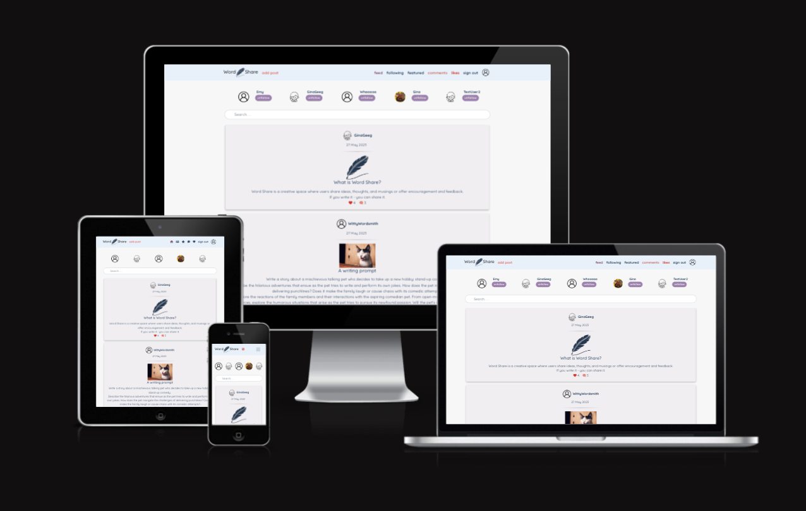

# Word Share

Word Share is a social media site for authors, writers, creators, artists, and anyone hoping to share their thoughts and ideas. Users are encouraged to provide feedback (upon request), interact with others through posts. Word Share provides a creative space for developing their skills as writers.

The live website can be found on [Heroku](https://wordshare.herokuapp.com/)  
To open links in a new browser tab, press CTRL + Click.

## Table of Contents

-   [User Experience Design (UX)](#ux)
    -   [Strategy](#strategy)
        -   [Site Functionality](#site-functionality)
            -   [Future Functionality](#future-functionality)
    -   [Scope](#scope)
        -   [Features](#features)
    -   [Structure](#structure)
    -   [Skeleton](#skeleton)
    -   [Surface](#surface)
-   [Testing](#testing)
-   [Deployment](#deployment)
-   [Credits](#credits)
-   [Media](#media)
    -   [Content](#content)
    -   [Acknowledgements](#acknowledgements)

## UX

### Strategy

-   As a **user**, I can **view featured posts which showcase random content** so that **I can interact with new posts**.

-   As a logged in **user**, I can **view all the posts by a specific user** so that **I can keep up to date with them**.

-   As a logged in **user**, I can **update my username and password** so that **I can change my display name and keep my account secure**.

-   As a logged in **user**, I can **follow other users** so that **I can keep up to date on the ideas that interest me**.

-   As a logged in **user**, I can **edit my account** so that **I can change my account picture**.

-   As a **user**, I can **edit my comments** so that **I can control my input**.

-   As a **user**, I can **view all the most recent posts** so that **I do not need to scroll through already consumed content**.

-   As a logged in **user**, I can **view user's avatars** so that **I can easily identify users of the application**.

-   As a logged in **user**, I can **comment on a post** so that **I can share my ideas and encouragement**.

-   As a **user**, I can **edit and delete my posts** so that **I can ensure my content is as intended**.

-   As a **user**, I can **sign in to the app** so that **I can access functionality for logged in users**.

-   As a ** logged in user**, I can **view a navbar from every page** so that **I can navigate easily between pages**.

-   As a **user**, I can **maintain my logged-in status until I choose to log out** so that **my user experience is not compromised**.

-   As a logged in **user**, I can **navigate through pages quickly** so that **I can view content seamlessly without page refresh**.

-   As a logged in **user**, I can **create posts** so that **I can share my ideas to receive encouragement or support**.

-   As a logged in **user**, I can **view the details of a single post** so that **I can interact with it**.

#### Site Functionality

Word Share’s homepage is a feed with an infinite scroll so users can scroll through posts ordered by most recently created. From there, users can easily navigate to a followed users feed, posts where the user has commented, posts the user has liked, a featured page which hosts a random post per day, and the user’s profile.

#### Future Functionality

-   Labels

-   Messaging

-   Replying to comments

-   Tagging users in posts and comments

### Scope

#### Features

-   Responsive Design across the range of devices available.
-   Easy to navigate post list makes it obvious to find which posts might interest a user.
-   User profiles allow for easy access to a creator’s posts.
-   All buttons are easy to find and indicate their purpose through color and labels
-   Users can edit and delete their own posts and comments in order to manage their own content.
-   Site visitors and registered users have access to search keywords in both post titles and content to find entries that match their interest.

### Structure

User Stories: Acceptance Criteria: Implementation

Sure! Here are the formatted statements:

> As a **user**, I can **view featured posts which showcase random content** so that **I can interact with new posts**.

-   **Acceptance Criteria:**
-   Users should be able to find a featured section where they can see a new featured post daily.
-   **Implementation:**
-   The featured post is responsible for showing a single highlighted post on a webpage.

> As a logged in **user**, I can **view all the posts by a specific user** so that **I can keep up to date with them**.

-   **Acceptance Criteria:**
-   The user should be able to find all posts by a single user.
-   **Implementation:**
-   The profile page lists out all posts associated with the user profile.

> As a logged in **user**, I can **update my username and password** so that **I can change my display name and keep my account secure**.

-   **Acceptance Criteria:**
-   Only authorized users should have access to sensitive account information and be able to update.
-   **Implementation:**
-   At sign in, users are validated through the back end which is then checked against the currentUser information.

> As a logged in **user**, I can **follow other users** so that **I can keep up to date on the ideas that interest me**.

-   **Acceptance Criteria:**
-   Users should be able to press a button to follow a chosen user.
-   **Implementation:**
-   Profiles are shown with a follow or unfollow button depending on the following status.

> As a logged in **user**, I can **edit my account** so that **I can change my account picture**.

-   **Acceptance Criteria:**
-   Users should be able to change their profile image as desired.
-   **Implementation:**
-   Users can navigate to their profiles and click the drop-down button to edit their profile.

> As a **user**, I can **edit my comments** so that **I can control my input**.

-   **Acceptance Criteria:**
-   Users should be able to edit the comments they’ve left on posts as desired.
-   **Implementation:**
    vUsers can navigate to their comments and click the drop-down button to edit or delete their comment.

> As a **user**, I can **view all the most recent posts** so that **I do not need to scroll through already consumed content**.

-   **Acceptance Criteria:**
-   The feed should be populated with all posts in a descending order.
-   **Implementation:**
-   The feed is ordered by creation date with an infinite scroll that allows users to “go back in time”.

> As a logged in **user**, I can **view user's avatars** so that **I can easily identify users of the application**.

-   **Acceptance Criteria:**
-   Users should be easily identifiable by their profile images.
-   **Implementation:**
-   All profiles are presented with profile images and their username is visible on desktop as well.

> As a logged in **user**, I can **comment on a post** so that **I can share my ideas and encouragement**.

-   **Acceptance Criteria:**
-   Users should be able to interact with posts by leaving a personal comment which shows their profile information.
-   **Implementation:**
-   Users can fill out the comment form at the bottom of the post and submit.

> As a **user**, I can **edit and delete my posts** so that **I can ensure my content is as intended**.

-   **Acceptance Criteria:**
-   Users should have an option to delete posts they’ve made.
    v**Implementation:**
-   -   At the post page, there is a dropdown that only the associated user can access which allows them to permanently delete the post and its associated comments.

> As a **user**, I can **sign in to the app** so that **I can access functionality for logged in users**.

-   **Acceptance Criteria:**
-   Users should be able to log in to the website for authenticated user interactions.
-   **Implementation:**
-   In the navigation bar there is a link that directs users to a form they can put their credentials into to log in.

> As a logged in **user**, I can **view a navbar from every page** so that **I can navigate easily between pages**.

-   **Acceptance Criteria:**
-   The navbar should be visible across the website.
-   **Implementation:**
-   The navbar component is attached to the main app and renders on every page.

> As a **user**, I can **maintain my logged-in status until I choose to log out** so that **my user experience is not compromised**.

-   **Acceptance Criteria:**
-   Users should not have to sign in at every reload or redirect.
-   **Implementation:**
-   Axios interceptors check for when the user’s access token has expired and refreshes it without bothering the user to sign in.

> As a logged in **user**, I can **navigate through pages quickly** so that **I can view content seamlessly without page refresh**.

-   **Acceptance Criteria:**
-   The pages should not refresh with every click of a link or button but allow the user to continue moving through the information.
-   **Implementation:**
-   Using react hooks, asynchronous requests and state updates, and conditional rendering, the app does not need to refresh after a user makes a request while still rendering the requested data.

> As a logged in **user**, I can **create posts** so that **I can share my ideas to receive encouragement or support**.

-   **Acceptance Criteria:**
-   A user should be able to create a post that other users can view.
-   **Implementation:**
-   On the add post page the user can fill out and submit a form which is then posted to the feed for all users.

> As a logged in **user**, I can **view the details of a single post** so that **I can interact with it**.

-   **Acceptance Criteria:**
-   Posts should be visible in their entirety for a user to be able to leave comments or to like it.
-   **Implementation:**
-   Posts found in feeds across the site are links which direct the user to the entire post allowing them the opportunity to interact with it.

### Skeleton

-   Wireframes

    -   Homepage
    -   

    -   Homepage Mobile
    -   
    -   Post detail
    -   

    -   Post detail Mobile
    -   
    -   User profile
    -   

### Surface

-   **Navigation Bar**

    -   Featured across the site, the full responsive navigation bar includes links displayed depending on the status of the visitor. If not logged in, the nav bar features the Home (or feed), sign-in, and sign-up pages. When logged in, users will see the Home (feed), Following, Featured, Comments, Likes, Sign-out and Profile pages.
    -   This section allows users to easily find clear and consistent navigation across the site without refreshing or pressing the back button.
    -   This section is responsive and will collapse into a toggle menu on smaller devices. The links become easy to understand icons.
        
        
        

-   **The Landing Page Feed**

    -   The landing feed is populated with previously created posts ordered by their creation date.
    -   This keeps the section updated and fresh but the infinite scroll allows users to go back as far as they desire.
        

-   **Following Section**

    -   The following section is a feed populated with the posts by users the current user is following.
    -   This allows the user to scroll through posts by users that they are interested in following and interacting with.  
        

-   **Featured Section**

    -   This section features a post that is chosen randomly once per day.
    -   This allows users the chance to interact with older posts they may have missed and users they don’t follow.
        

-   **Comments**

    -   The comments section features posts that the user has commented on.
    -   This section allows the user to easily and quickly navigate to their comments both to continue discussions and to edit or delete as desired.
        

-   **Likes**

    -   The likes section features posts that the user has liked.
    -   This section allows the user to easily and quickly navigate to their likes to both continue to interact with liked posts and to remove as desired.
        

-   **The Sign Up Page**

    -   This page informs potential users what Word Share is about.
    -   Users can quickly and easily sign up with alerts letting them know when and why an attempt to sign up fails.
        

-   **The Sign In Page**

    -   This page provides a clear and easy way for users to log in to the site.
    -   Alerts let users know when and why an attempt to log in fails.
        

-   **Add/Edit Posts**

    -   Users can add a post with an optional image, easily edit their post and change the image, and delete their post.
        
        

-   **Add/Edit Comments**

    -   Users can add, edit, and delete comments on posts.
        
        

-   **Profile**
    -   Users can view their own profile or other users’. There is a count logging the number of posts, followers, and users followed.
    -   From the user’s profile, they can edit their username, password, profile picture, and biography.
        
        

## Testing

### Manual Testing during development

-   During the development and deployment stage, I ensured that:

    -   Initial launch was successful
    -   Rigorous testing of posting capabilities for a variety of users: All users have successfully added posts
    -   Rigorous testing of commenting capabilities for a variety of users: All users have successfully added comments
    -   Only authorized users can add posts and leave comments
    -   Only users verified to have created posts and comments are able to delete or edit
    -   Fields to edit comments and posts are prepopulated with initial data
    -   Only verified users can like and unlike posts
    -   Users who have signed up have access to their user profile and other users’ profiles.
    -   Alert messages display accurately
    -   Users were authorized using JSON web tokens to ensure restricted access.

    -   User uploaded images display correctly and can be updated using the proper form
    -   Bootstrap delivers a visually appealing and user-friendly app across all screen sizes
    -   Site users cannot access admin portal.

-   Automated testing
    -   Due to time constraints, tests were not built for this project.

## Deployment

-   My site was deployed to Heroku. After creating a secure environment, I created an app on Heroku.

-   Create new app

-   Attach Heroku Postgres as Database in resources

-   Configured variables by matching keys and values both on heroku and in my secure environment

-   Connected the appropriate repository

-   After building the app in my IDE, I made a final deployment.

-   Changed debug to false in settings

-   Navigated to the deploy option in my app on heroku

-   Deployed branch

## Credits

### Media

-   The NavBar, comment, and like icons are from FontAwesome.
-   Favicon was created by Freepik and downloaded with permission from [flaticon](https://www.flaticon.com/free-icon/feather_9212934?related_id=9212934).

-   The logo, add post, no results, and error icons/images were created by Freepik and and downloaded with permission from [flaticon](https://www.flaticon.com/authors/freepik)
-   The upload icon was created by SeyfDesigner and and downloaded with permission from [flaticon](https://www.flaticon.com/free-icon/image_8191581?term=upload&page=1&position=42&origin=search&related_id=8191581)

### Content

-   The core project is from Code Institute’s Moments walkthrough. I have added, removed, and altered what was necessary to create a unique social media website that fits my purpose.

### Acknowledgements

-   The logic behind this website required help from those on the Code Institute slack workspace as well as the Code Institute tutor team for me to understand. Thank you all!
-   I'd also like to acknowledge my husband who is a senior programmer with many years of experience with React. Much of this code was written with his support and mentorship!
